# Extensões IngeTrazo — Barras "Styles" e "Shadows"

Duas barras de ferramenta para o [IngeTrazo](https://github.com/ingelibre/ingetrazo),
inspiradas no SketchUp: uma de **estilos de exibição** e outra de **sombras**.

- **Autor:** Ezequiel M. Rezende
- **Data:** 2026-10-01
- **Versão:** 1.4.0
- **Licença:** [GPL-3.0-or-later](https://www.gnu.org/licenses/gpl-3.0.html)
  (mesma do IngeTrazo — ver [LICENSE](https://github.com/ingelibre/ingetrazo/blob/main/LICENSE))

---

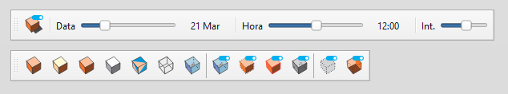

*A barra **Styles** (treze botões de estilo) e a barra **Shadows**
(data, hora, calendário, intensidade, fonte de mapa e localização).*

---

## Arquivos

```
<plugins>/
├── igz_tb_style.py          # barra "Styles"
├── igz_tb_shadows.py        # barra "Shadows"
├── README.md                # este arquivo (inglês)
├── README_ptBR.md           # esta versão em português
├── LICENSE                  # texto completo da GPL-3.0
├── THIRD-PARTY.md           # avisos de terceiros
└── icons/
    ├── tb_default.svg            / tb_default_light.svg
    ├── tb_architectural.svg      / tb_architectural_light.svg
    ├── tb_shaded.svg             / tb_shaded_light.svg
    ├── tb_hiddenline.svg         / tb_hiddenline_light.svg
    ├── tb_monochrome.svg         / tb_monochrome_light.svg
    ├── tb_wireframe.svg          / tb_wireframe_light.svg
    ├── tb_xray.svg               / tb_xray_light.svg
    ├── tb_xraytoggle.svg         / tb_xraytoggle_light.svg
    ├── tb_edges.svg              / tb_edges_light.svg
    ├── tb_profiles.svg           / tb_profiles_light.svg
    ├── tb_backedges.svg          / tb_backedges_light.svg
    ├── tb_hiddenobjects.svg      / tb_hiddenobjects_light.svg
    ├── tb_hiddengeometry.svg     / tb_hiddengeometry_light.svg
    └── tb_shadowtoggle.svg       / tb_shadowtoggle_light.svg
```

---

## Barra "Styles"

Treze botões que **espelham os comandos nativos** do menu
**Câmera ▸ Estilo**. A barra não reimplementa nenhuma lógica de estilo —
ela localiza a `QAction` correspondente na janela principal e chama
`trigger()` nela, exatamente como se o usuário tivesse clicado no item
do menu.

Os rótulos abaixo são as **strings-fonte em inglês** do IngeTrazo — as
mesmas chaves que o menu nativo passa para `tr()`. Os botões aparecem
traduzidos para o idioma em que o IngeTrazo estiver (ver *Idioma*
abaixo), e cada botão mostra o mesmo texto do item de menu nativo.

| Botão (origem)      | Tipo   | Icone |
|---------------------|--------|----|
| **Default**         | style  | 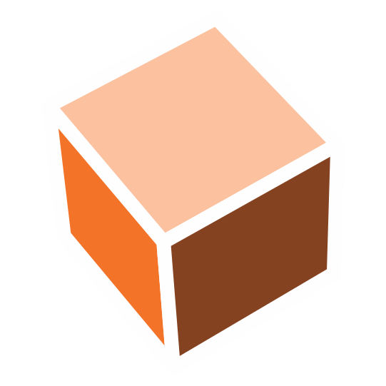 |
| **Architectural**   | style  | 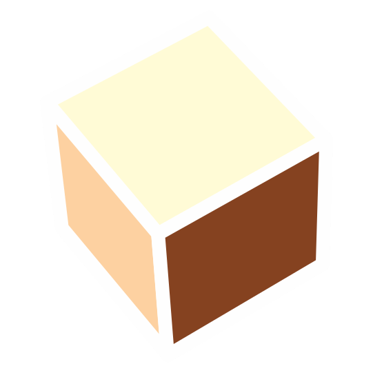 |
| **Shaded**          | style  |  |
| **Hidden line**     | style  | 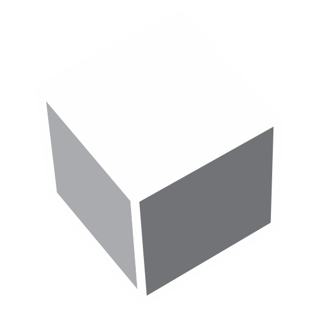 |
| **Monochrome**      | style  | 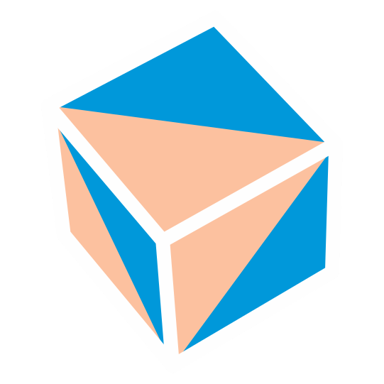 |
| **Wireframe**       | style  | 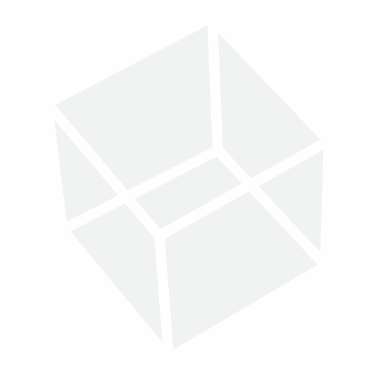 |
| **X-ray**           | style  | 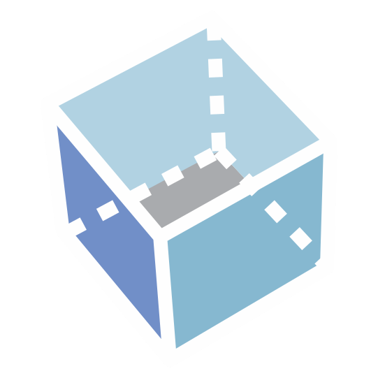 |
| **Toggle X-ray**    | toggle | 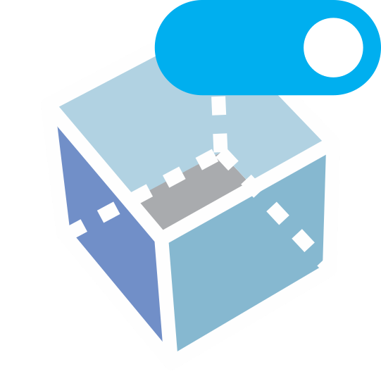 |
| **Edges**           | toggle | 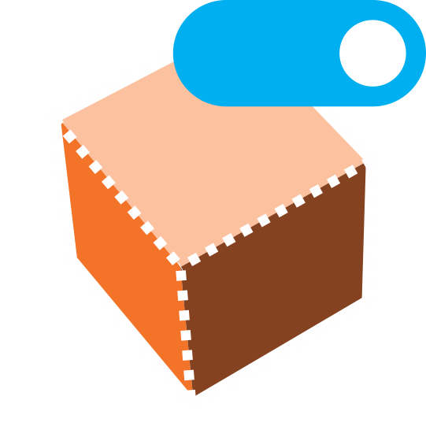 |
| **Profiles**        | toggle | 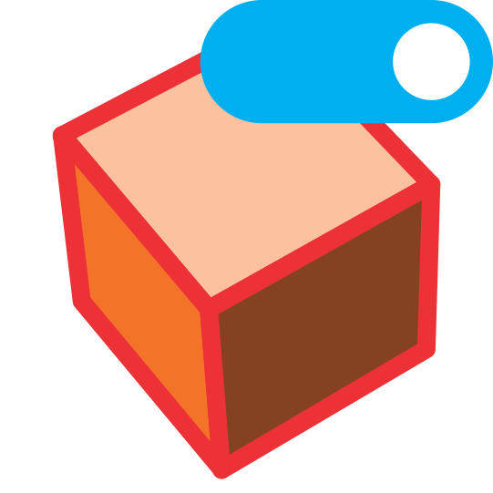 |
| **Back edges**      | toggle | 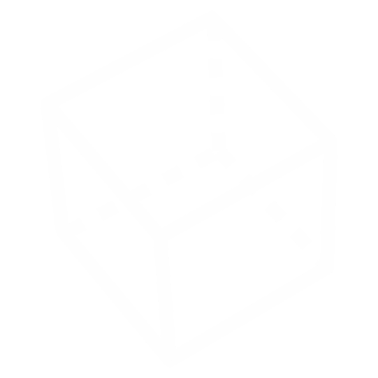 |
| **Hidden Objects**  | toggle | 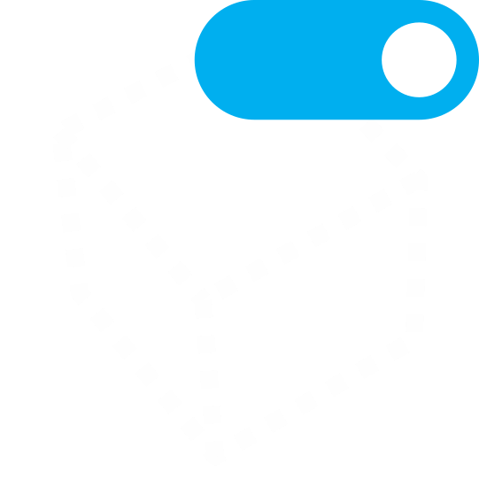 |
| **Hidden Geometry** | toggle | 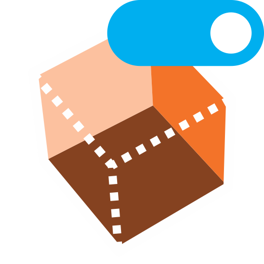 |

**Mecanismo:** para cada botão, `_trigger_action()` procura na janela
principal a `QAction` nativa cujo rótulo é aquela string-fonte em inglês
— em qualquer idioma, via `core.i18n.source_of` — e chama `trigger()`
nela. Nada é mutado diretamente — o comando nativo roda com todos os seus
efeitos usuais (estado do menu, eixos, redesenho etc.), então a barra e o
menu nunca saem de sincronia.

> A ordem da barra segue a ordem do menu, com um separador inserido
> antes dos toggles de exibição (*Toggle X-ray*, *Edges*, *Profiles*,
> *Back edges*) e outro antes dos toggles de visibilidade
> (*Hidden Objects*, *Hidden Geometry*).

---

## Barra "Shadows"

Um toggle, dois sliders coloridos, um botão de calendário, um slider de
intensidade e uma linha de controles de fonte/localização, seguindo o
modelo do SketchUp.

| Controle | Campo afetado | Faixa |
|----------|---------------|-------|
| **Toggle** (ícone) | `scene.shadows.enabled` | on/off |
| **Data** (slider) | `scene.shadows.month` + `.day` | 1–365 (dia do ano) |
| **Hora** (slider) | `scene.shadows.hour` + `.minute` | 0–1439 min |
| **Calendário** (ícone) | `scene.shadows.month`/`.day`/`.hour`/`.minute` | diálogo de data + hora |
| **Int.** (slider) | `scene.shadows.darkness` | 0–100 (→ 0.0–1.0) |
| **Fonte** (combo) | fonte de mapa do painel Terreno | Esri / Sentinel-2 / OSM |
| **Localização** (linha) | `scene.shadows.latitude` + `.longitude` | coordenadas + seletor no mapa |

Notas sobre os controles:

- **Slider de Data** — pintado com um **gradiente sazonal** (hemisfério
  sul: vermelho no verão → amarelo no inverno) e com as iniciais dos meses
  (*J F M A M J J A S O N D*) embaixo.
- **Slider de Hora** — pintado com um **gradiente dia/noite** (noite
  azul-escura → dia claro → noite azul-escura) e com o **nascer do sol**,
  o **Meio-dia** e o **pôr do sol** do dia embaixo.
- **Botão Calendário** — abre um diálogo com `QCalendarWidget` e
  `QTimeEdit` para digitar data e hora exatas.
- **Fonte / Localização / Carregar mapa** — integram com o painel
  **Terreno** (BaseMap) do IngeTrazo: escolha a fonte dos tiles, digite as
  coordenadas do projeto ou use o botão de seleção no mapa, que roda o
  comando nativo *Buscar localização* do painel. *Carregar mapa* mantém os
  tiles baixados; se estiver desmarcado, os tiles são descartados assim que
  as coordenadas são aplicadas.

As marcas de **nascer** e **pôr do sol** são calculadas por um **algoritmo
solar interno, sem dependências externas** (*Almanac for Computers* /
USNO, ±2 min típico), a partir de `latitude`, `longitude` e `utc_offset` da
cena — então elas se atualizam quando a data ou a localização muda (nunca
quando só o slider de hora se move).

**Mecanismo:** mudar os campos de `scene.shadows` e chamar
`viewport.update()`. O `paintGL` do IngeTrazo **relê `scene.shadows` a
cada frame** e recalcula a direção do sol, regenera o shadow map e
redesenha tudo automaticamente. Nada mais precisa ser tocado.

Arrastar qualquer slider liga as sombras automaticamente (senão os
ajustes não ficariam visíveis).

---

## Ícones & temas

Cada botão traz **duas variantes de ícone**, para a barra continuar
legível tanto em interfaces escuras quanto claras:

- `tb_<nome>.svg` — a variante padrão (usada em temas escuros).
- `tb_<nome>_light.svg` — a variante para tema claro.

Na inicialização, `_load_themed_icon()` inspeciona a cor `QPalette.Window`
da janela principal. Em uma interface **clara** ela carrega o arquivo
`_light.svg` quando ele existe e, caso contrário, cai no ícone padrão; em
uma interface escura usa sempre o padrão. Nenhuma configuração é
necessária — os ícones seguem o tema do aplicativo automaticamente.

---

## Compatibilidade com a API de plugins do IngeTrazo

O IngeTrazo declara em [`docs/plugins.md`](https://github.com/ingelibre/ingetrazo/blob/main/docs/plugins.md):

> The plugin API is **not stable yet** — expect breaking changes during
> the 0.x series.

As duas extensões **funcionam** na versão atual (0.5.x), mas usam alguns
pontos que **não fazem parte da API pública de extensão**. Estão todos
marcados com `⚠️ FRÁGIL` no código-fonte. Lista consolidada:

### Pontos frágeis em `igz_tb_style.py`

| Símbolo | Onde | Por quê |
|---|---|---|
| Busca de `QAction` por rótulo | `_find_action` / `_trigger_action` | Casa a string-fonte em inglês do IngeTrazo via `core.i18n`; só quebra se o IngeTrazo renomear essa fonte |
| `QToolBar` + `MainWindow.addToolBar(...)` | `_create_style_toolbar` | Fora da API `app.add_panel` / `app.add_menu_action` |

### Pontos frágeis em `igz_tb_shadows.py`

| Símbolo | Onde | Por quê |
|---|---|---|
| `viewport.scene.shadows` | `_get_scene_shadows` | Cadeia interna; a cena não está em `app.scene` |
| `ShadowSettings.{enabled, month, day, hour, minute, darkness, latitude, longitude, utc_offset}` | várias | Dataclass interna (`core.sun`) |
| Internos do `BaseMapPanel` (`_source`, `_find`, `_lat`, `_lon`, `_last_sid`) | `_find_base_map_panel` / `_open_native_georef_dialog` | Alcançados via `findChildren`; o painel **Terreno** não é API pública |
| Snapshot de `scene.{tile_layer, terrain, photo_mesh}` | `_open_native_georef_dialog` | Atributos internos da cena, restaurados quando *Carregar mapa* está desligado |
| `QToolBar` + `MainWindow.addToolBar(...)` | `_create_shadows_toolbar` | Idem acima |

### O que **está** de acordo com o `plugins.md`

- Arquivo `.py` na pasta de plugins correta.
- Define `setup(app)` no nível do módulo.
- Tolerante a falhas: qualquer exceção dentro dos callbacks é capturada e
  logada — o app continua funcionando.
- Não mexe no documento sem passar pelo comando (a barra Styles delega
  tudo aos comandos nativos; a barra Shadows só toca em `scene.shadows`).
- Não assume `sys.path` nem importa o próprio pacote.
- Respeita threading (tudo na main thread).

### O que **não** está previsto pelo `plugins.md`

- Barras de ferramenta horizontais **não** têm API oficial na versão 0.x.
  O documento menciona `app.add_panel(...)` (aba lateral),
  `app.add_menu_action(...)` (item de menu) e `app.add_context_menu(...)`,
  mas não `add_toolbar(...)`. Estas extensões usam `QToolBar` **direto via
  PySide** — funciona, mas é o caminho "informal".
- Não há subclasse de `tools.base.Tool`. Isso significa que os plugins
  **não aparecem no menu Extensions**, não têm atalho e não entram na
  busca F3. Se isso for desejado, ver "Melhorias futuras" abaixo.
- Nenhuma persistência via `app.document_data`. Os valores de sombra já
  vivem dentro de `scene.shadows` (e são salvos no `.igz` como parte do
  documento), mas a posição dos sliders **não** é lembrada.

### Se a API 0.x quebrar

- **Barra Styles:** a busca casa as strings-fonte em inglês do IngeTrazo
  através do `core.i18n`, então traduzir a interface não quebra mais.
  Só quebraria se o IngeTrazo renomeasse a própria string-fonte (aí
  atualize `MENU_ACTIONS`); cada falha é registrada no log.
- **Barra Shadows:** `viewport.scene.shadows` → verificar se `app.scene`
  passa a expor a cena diretamente (o `plugins.md` menciona `app.scene`
  na API `setup`).
- **Ambas:** `QToolBar` → se aparecer `app.add_toolbar(...)`, migrar.

---

## Idioma & internacionalização

A interface do IngeTrazo é traduzida por um catálogo JSON leve
(`core/i18n.py`; o inglês é o idioma-fonte; os catálogos ficam em
`i18n/<lang>.json`). As barras o reutilizam:

- **Nomes de comandos nativos** (`Default`, `Edges`, `Shadows`…) vêm
  direto do catálogo do IngeTrazo via `tr()`, então sempre batem com o que
  o menu **Câmera ▸ Estilo** mostra.
- **Nossas próprias strings** (títulos das barras, os rótulos dos sliders
  `Date`/`Time`/`Int.`, `Location`, `Select Location`, `Calendar`, `Source`,
  `Load map`, `Noon`, a dica do toggle e o diálogo de erro) não estão no
  catálogo do IngeTrazo, então o plugin traz uma pequena tabela para
  inglês, espanhol, indonésio, italiano e português do Brasil; qualquer
  outro idioma cai no inglês. As abreviações de mês e as iniciais dos meses
  sob o slider de data são localizadas do mesmo modo (`_LOCAL_MONTHS` /
  `_LOCAL_MONTH_LETTERS`).
- **Trocar de idioma:** **Janela ▸ Idioma** do IngeTrazo aplica na próxima
  inicialização (ele avisa isso numa mensagem). As barras seguem o idioma
  ao iniciar e um pequeno timer também as re-rotula no momento em que o
  idioma muda, sem tocar no resto da interface.

Você **não** precisa editar nada para aproveitar um idioma que o IngeTrazo
já oferece: os nomes de comandos vêm do catálogo dele. Para traduzir as
poucas strings do próprio plugin para um novo idioma, acrescente o código
em `_LOCAL` (e, para as abreviações/iniciais de mês, `_LOCAL_MONTHS` e
`_LOCAL_MONTH_LETTERS`) no topo de `igz_tb_shadows.py` / `igz_tb_style.py`.

---

## Instalação

1. Localize a pasta de plugins do IngeTrazo:
   - **Linux:** `~/.local/share/ingetrazo/plugins/`
   - **Windows:** `%APPDATA%\ingetrazo\plugins\`
   - Ou use o menu **Extensões ▸ Abrir pasta de plugins**.
2. Copie `igz_tb_style.py`, `igz_tb_shadows.py`, `README.md` e a pasta
   `icons/` para lá.
3. Reinicie o IngeTrazo.

As barras **Styles** e **Shadows** aparecem na área superior.

### A partir do catálogo de extensões do IngeTrazo

A extensão também está empacotada para o catálogo da comunidade em
<https://ingetrazo.com/extensiones> (repositório
<https://github.com/ingelibre/ingetrazo-extensions>), que instala um único
`.zip` contendo uma pasta com um `__init__.py`. Gere esse arquivo com
`packaging/build_extension.ps1` (Windows) ou `packaging/build_extension.py`
(qualquer sistema); ele sai em `dist/igz_toolbars.zip`. Veja
[`PUBLISHING.md`](PUBLISHING.md) para os passos de release e submissão.

---

## Uso

### Styles
- Clique em qualquer botão para rodar o comando correspondente em
  **Câmera ▸ Estilo** — o efeito é exatamente o mesmo, e o estado do
  menu permanece sincronizado.
- **Alternar raio-X**, **Arestas**, **Perfis** e **Arestas de trás**
  são toggles: cada clique inverte o flag nativo correspondente.

### Shadows
- Clique no ícone para **ligar/desligar** sombras.
- Arraste o slider **Data** → a sombra gira ao longo do ano (as iniciais
  dos meses embaixo marcam os meses; a cor da trilha é um gradiente
  sazonal).
- Arraste o slider **Hora** → a sombra gira ao longo do dia (a cor da
  trilha é um gradiente dia/noite; os horários embaixo são o **nascer do
  sol**, o **meio-dia** e o **pôr do sol** daquele dia).
- Clique no botão **Calendário** para escolher **data e hora** exatas.
- Arraste o slider **Int.** → sombra mais clara ou mais escura.
- Escolha uma **Fonte** de tiles e defina a **Localização** (digite as
  coordenadas ou use o botão de seleção no mapa) para definir a
  latitude/longitude do projeto; as marcas de nascer/pôr do sol
  acompanham. *Carregar mapa* mantém os tiles baixados; caso contrário
  eles são descartados depois de aplicar as coordenadas.

---

## Melhorias futuras (opcional)

Tudo o que o `plugins.md` recomenda e que ainda **não** está implementado.
Nenhuma destas melhorias é necessária — as barras funcionam bem sem elas.

1. **`Tool` subclasse** para cada extensão: "Styles…" e "Shadows…" no
   menu Extensions, com atalhos. Permite que o usuário reabra a barra se
   ela for fechada.

2. **Persistência em `app.document_data`**: guardar as posições dos
   sliders no `.igz` para que, ao reabrir, tudo esteja como estava.

3. **Migrar para `app.add_panel(...)`** se quiser 100% de conformidade
   com a API. Perde-se o formato "barra horizontal", mas ganha-se
   integração com a bandeja lateral (Janela ▸ Painéis).

4. ~~**Busca robusta de QAction** na barra Styles: usar `objectName` em vez
   do `text()` visível, para a barra sobreviver a mudanças de idioma da
   interface.~~ **Feito** — a busca agora resolve a string-fonte em
   inglês do IngeTrazo via `core.i18n`, então sobrevive a mudanças de
   idioma.

5. **Botão "Agora"** para resetar data/hora ao momento atual.

6. **Expor `utc_offset`** em um combo (o campo existe em
   `ShadowSettings`).

---

## Licença

GPL-3.0-or-later — a mesma licença do IngeTrazo.
Avisos de terceiros ficam em [THIRD-PARTY.md](THIRD-PARTY.md).

Ver <https://www.gnu.org/licenses/gpl-3.0.html>.

Copyright (C) 2026 Ezequiel M. Rezende.

Este programa é software livre: você pode redistribuí-lo e/ou modificá-lo
sob os termos da GNU General Public License, versão 3 ou posterior,
conforme publicada pela Free Software Foundation.

Este programa é distribuído na esperança de ser útil, mas **sem qualquer
garantia**; sem mesmo a garantia implícita de **comercialização** ou
**adequação a um propósito específico**. Veja a GNU General Public License
para mais detalhes.
```

---

### Tabela de correspondência (EN ↔ PT-BR)

| Seção | Inglês | Português |
|---|---|---|
| Título | Extensions — "Styles" and "Shadows" Toolbars | Extensões — Barras "Styles" e "Shadows" |
| Arquivos | Files | Arquivos |
| Barra Styles | "Styles" Toolbar | Barra "Styles" |
| Botão (origem) | Button (source) | Botão (origem) |
| Tipo | Type | Tipo |
| Estilo / toggle | style / toggle | estilo / toggle |
| Mecanismo | Mechanism | Mecanismo |
| Compatibilidade | Compatibility | Compatibilidade |
| Idioma & internacionalização | Language & internationalization | Idioma & internacionalização |
| Pontos frágeis | Fragile points | Pontos frágeis |
| Se a API 0.x quebrar | If the 0.x API breaks | Se a API 0.x quebrar |
| Instalação | Installation | Instalação |
| Uso | Usage | Uso |
| Melhorias futuras | Future improvements | Melhorias futuras |
| Licença | License | Licença |
